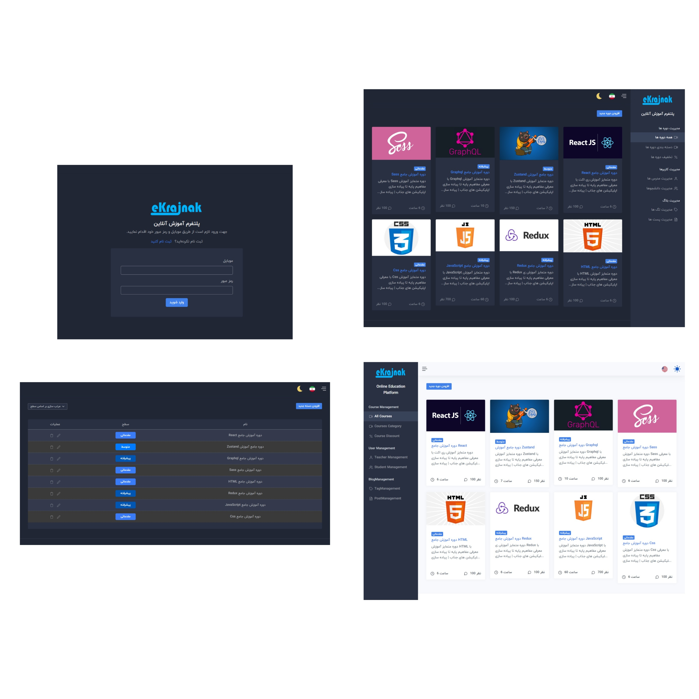

# Admin Dashboard

### Description: 
Developed an Admin Dashboard application with essential features for managing courses and users efficiently. The application focuses on providing a seamless user experience with   multilingual support, dynamic theming, and robust form handling.
### Key Features:
#### Login Page: 
  Implemented a secure login page with form validation using React Hook Form.
#### Dynamic Forms: 
  Created dynamic and reusable forms with validation schemas using React Hook Form and Yup.
#### Multilingual Support: 
  Integrated i18next for bilingual (or multilingual) functionality, allowing users to switch languages dynamically.
#### Dark/Light Theme: 
  Developed a theme toggle feature to switch between dark and light modes, with preferences stored in local storage.
### Course Management: 
  Created sections to display all courses, add new courses, and edit or delete existing ones.
#### API Integration: 
  Used Axios for interacting with backend APIs, handling CRUD operations for courses.
#### Local Storage: 
  Leveraged local storage to persist user preferences like theme and language settings across sessions.
### Technologies Used: React, SPA architecture, i18next

